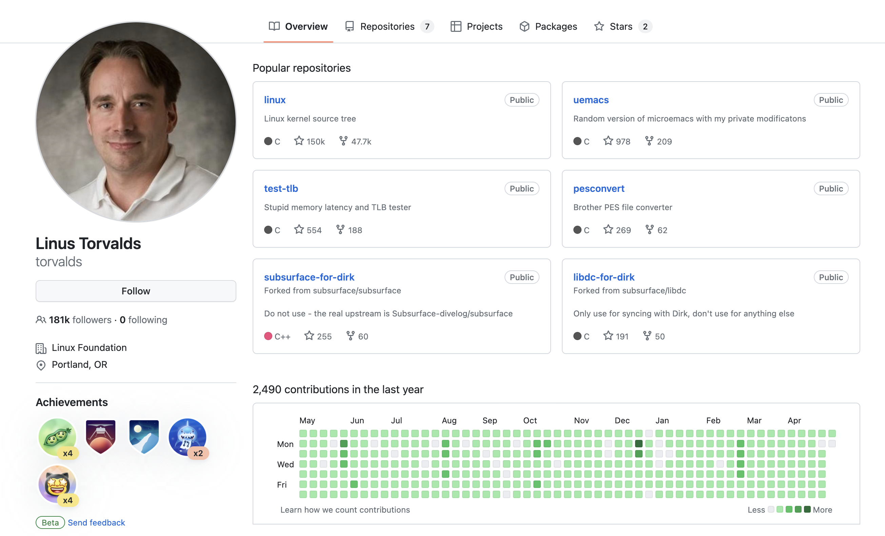

# active_dev

## Description
Are you a begginer programmer, who wants to boost their GitHub?
Or maybe you are tired of recruiters asking why your GitHub is not active?
Or maybe you just want your GitHub to look like this?

Worry not, this Airflow project will help you to mimick the activity in your GitHub profile by generating random number of commits on a daily basis.

## Prerequisites
1. [Python3](https://www.python.org/downloads/)
2. [Docker Desktop](https://www.docker.com/products/docker-desktop/)

## Quickstart
1. Fork this repo
2. Clone the repo to your local machine
3. Create virtual environment for the project in your working directory:
`python3 -m venv active_dev_env`
4. Activate it:
`source active_dev_env/bin/activate`
5. Create directories for airflow in your working directory:
`mkdir -p ./dags ./logs ./plugins`
6. Initialize the db:
`docker compose up airflow-init`
7. Run this command to extend your airflow image:
`docker build . --extending_airflow:latest`
8. Start containers for our application:
`docker compose up -d`
